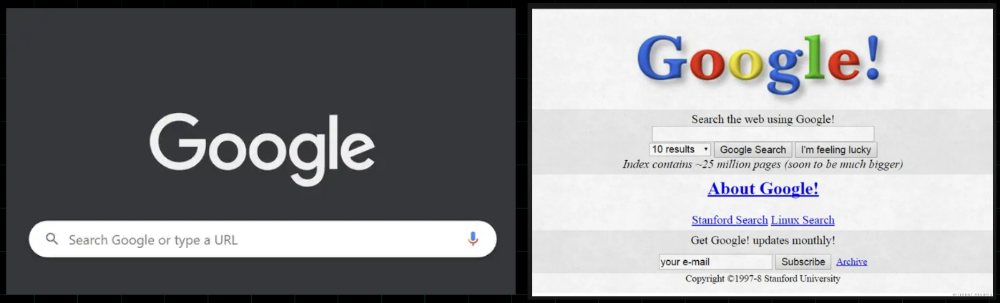
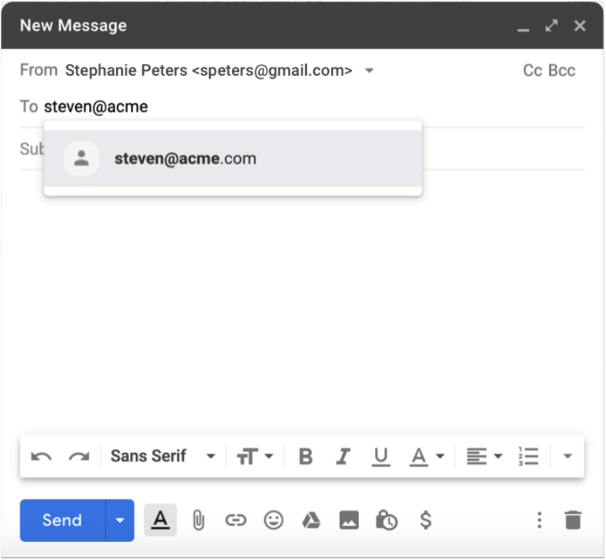
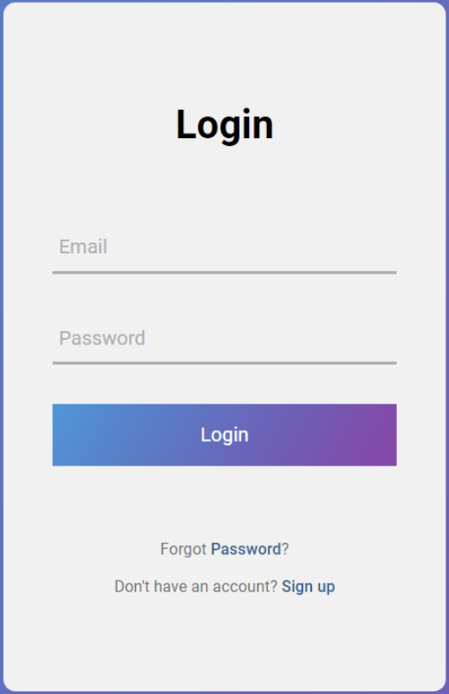
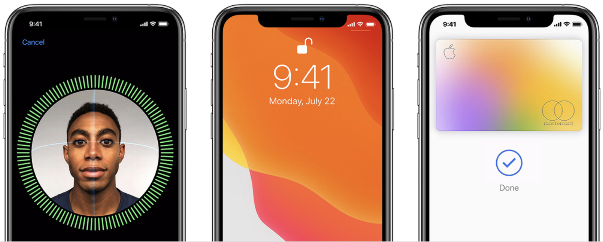
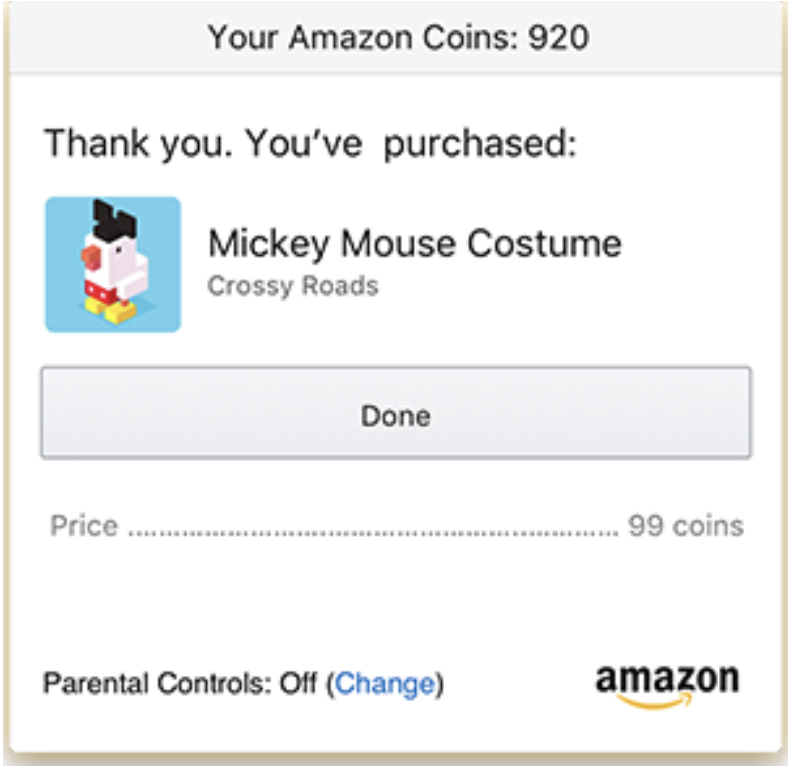
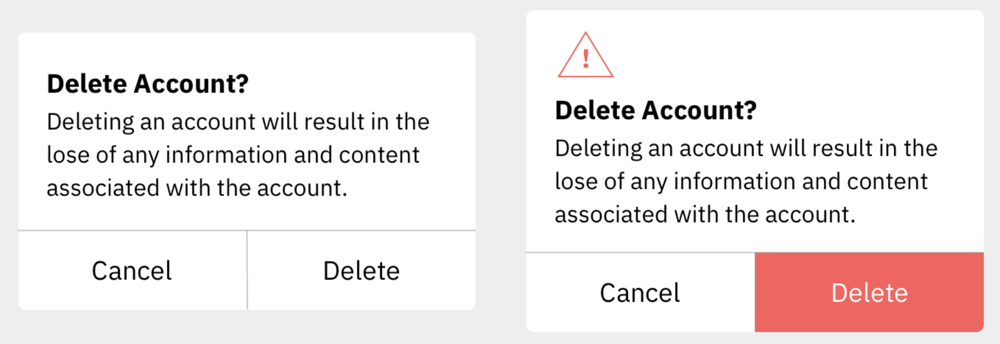
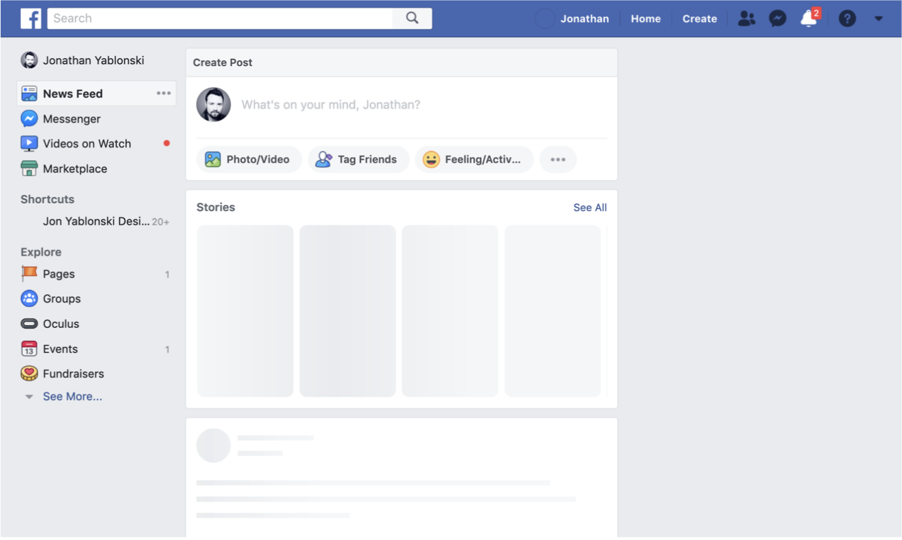

# Laws of UX

## 1. Fitts's Law

It states that the time to acquire a target is a function of the distance to and size of the target.

There are three key considerations:
A. Size - targets should be large enough that the users can easily discern them and accurately select them.
B. Space - touch targets should have ample space between them.
C. Position - touch targets should be placed in areas of the interface that allow them to be easily acquired.

## 2. Hick's Law

It states that the time it takes to make a decision increases with the number and complexity of choices available.

It means that, the more choices to choose from, the longer it takes the user to decide on which to interact with. Our goal when creating a service/product is to synthesize information and present it in a way that does not overwhelm the user. Redundancy and excessiveness in design will only create confusion. We can avoid this by breaking down the tasks into smaller steps and simplifying the interface or process.

**Example:** Previously the landing page of Google had been cluttered and had a lot of options, which indeed was complex and overwhelming. The current page is minimal and is aesthetic. The focus is provided only for the search section, this provides a quick and easy way for people to search the Web.

## 3. Miller's Law

The average human can keep only 7 (+2) items in their working memory. 

Chunking helps to retain information more efficiently. When designing, organize content into smaller chunks to help users scan, process, understand and memorize easily.

## 4. Tesler's Law (Law of conservation of complexity)

States that for any system there is a certain amount of complexity that cannot be reduced.

As designers, our role is to remove complexity from our interfaces, if not we are shipping that complexity to our users. This can result in frustration and bad user experience. Designers should handle complexity during design and development.

**Example:** When you write an email, there are two required pieces of information: the sender's address and the recipient's address. The email cannot be sent if either of these is missing, and therefore it's a necessary complexity. To reduce this complexity, a modern email client will do two things: pre-populate the sender (it can do this because it is aware of your email address), and provide suggestions for the recipient as you begin to type their address, based on prior emails and/or your contacts. The complexity is not entirely gone, but the experience of writing an email is made a little simpler by removing the complexity of filling in the addresses. Taking that a step further, Gmail now leverages artificial intelligence (AI) within your emails through a feature called Smart Compose. This intelligent feature can scan what you have typed and use that content to suggest the next words or phrases to complete that sentence.

## 5. Jakob's Law

Users spend most of their time on other sites, and they prefer your site to work the same way as all the other sites they already know. It is about creating designs that conform to established models of how interfaces look and feel. It will reduce the burden on users. Users find it easier to navigate through an interface when the design resembles the one they already know from other interfaces.

**Example:** E-commerce websites. Online shoppers have certain expectations based on their previous experiences with other e-commerce sites. For example, they expect to see product images, descriptions, and prices. They also expect to see a shopping cart icon in the top right corner of the site and an add-to-bag button on the right side of the product page.

## 6. Postel's Law

*Be conservative in what you do, be liberal in what you accept from others.*

Since humans and computers communicate and process information in different ways, the design should bridge the communication gap.

**Example 1:** Forms - be conservative in how much information you ask the user to provide. Any non-essential data should be left out or kept as optional. The more fields you require them to fill out the more effort you are asking of them.

**Example 2:** Apple's Face ID - the facial recognition without the need to provide a username/password. It is robust enough to accept varying types of human inputs meaning it is more flexible.

## 7. The Peak-End Rule

*People judge an experience largely based on how they felt at its peak and at its end.*

It is also known as memory bias. Instead of considering the entire duration of the experience, we tend to focus on an emotional peak and on the end. People recall negative experiences more vividly than the positive ones. This observation strongly suggests that we should pay close attention to these critical moments to ensure users evaluate an overall experience positively. Identify the moments when your product is most useful, valuable or entertaining and design to delight the users.

**Example:** An eCommerce platform that dwells on the price will make the user feel bad about spending that cash. After all, losing money isn't just a bad experience; it's a horrible experience. So instead of ending the purchase with a big ol' bill, why not end it by reminding the customer what they're getting? That's what Amazon does. After you finish spending money, it reminds you why you spent that money in the first place.

## 8. The Aesthetic-Usability Effect

*Users often perceive aesthetically pleasing design as design that's more usable.*

Aesthetically pleasing designs can influence usability, create positive emotional response, increase the perception of usability. People form an opinion about a website within a few seconds of seeing it, and the visual appeal is a primary determining factor. So, an aesthetically pleasing design can lead users to believe that the design actually works better.

## 9. The von Restorff Effect

*When multiple similar objects are present, the one that differs from the rest is most likely to be remembered.*

It is a powerful guideline for how to use contrast to direct people's attention to the most relevant content. Some of the factors are color, shape, size, position and so on.

**Example:** one with buttons that are visually indistinct from one another, and another with emphasis placed on the most important button. The lack of visual contrast in the modal on the left could easily lead to people accidentally selecting the wrong action. By placing a visual emphasis on the destructive action, the version on the right will not only help guide users who want to delete their accounts to the correct option but will also help those who don't intend to delete their accounts avoid accidentally selecting this option. For extra safety, there is also a warning icon included in the header of the modal on the right to help draw attention and communicate the importance of the content within the modal.

## 10. The Doherty Threshold

*Productivity soars when a computer and its users interact at a pace (<400 ms) that ensures that neither has to wait on the other.*

It means that performance is critical to a good user experience. Emotions can easily turn to frustration and leave a negative lasting impact when users who are trying to achieve are met with slow processing, lack of feedback or more load times. Progress bars help make waiting more tolerable. Animation is one way to visually engage people while loading or processing.

**Example:** the presentation of a skeleton screen of Facebook when content is loading. This technique makes the site appear to load faster by instantly displaying placeholder blocks in the areas where content will eventually appear. The blocks are progressively replaced with actual text and images once they are loaded. This reduces the impression of waiting, which increases the perception of speed and responsiveness even if the content is loading slowly.