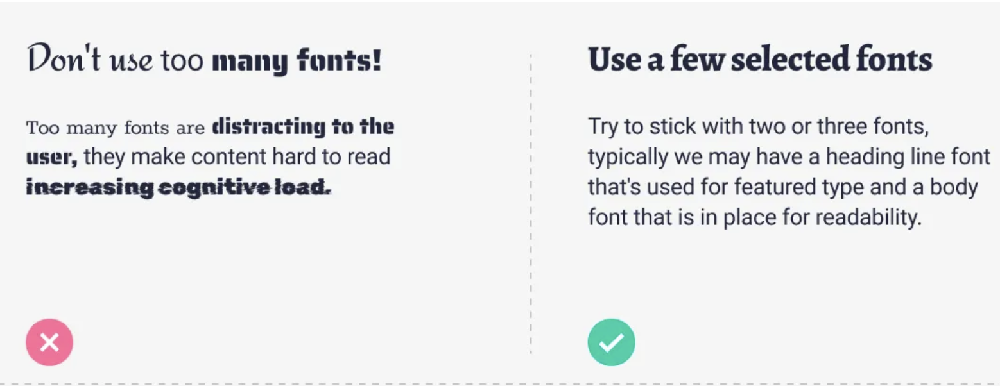

## Typography and Font Pairing

Typography deals with the font family, typefaces, and readability. Using too many fonts can be distracting for users. Try to stick with two or three fonts, typically a heading line font for featured type and a body font for readability.

**Font Pairing:** font combinations. It is the creative technique of putting fonts together harmoniously, in a way that pleases the eye and matches the intended message. Font pairing is not only the way fonts work together but also how these fonts complement the copy.

## Color Theory and Harmonious Palettes

Color theory involves the primary rules and guidelines that surround color and its use in creating aesthetically pleasing visuals. Selecting the right color combination is crucial for creating harmonious color palettes.
