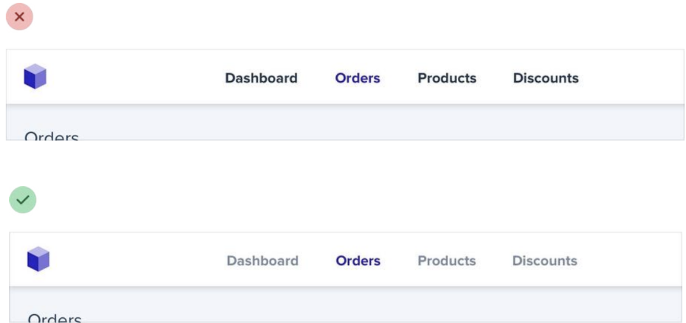
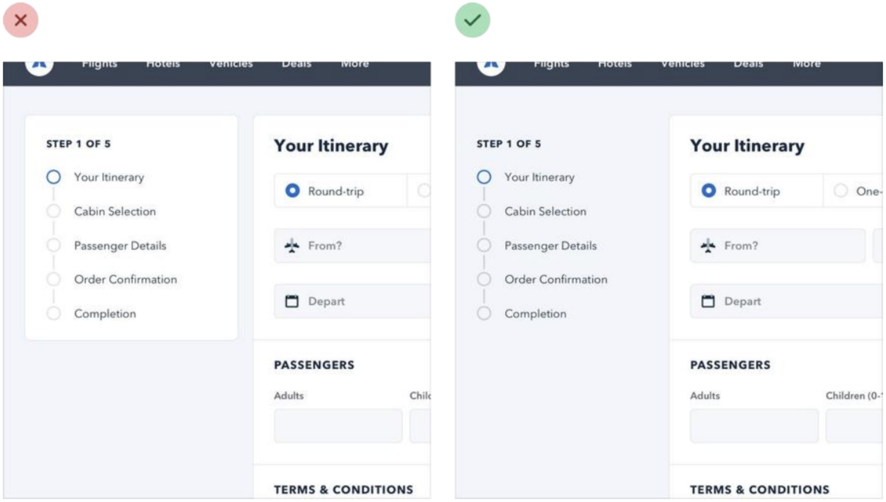
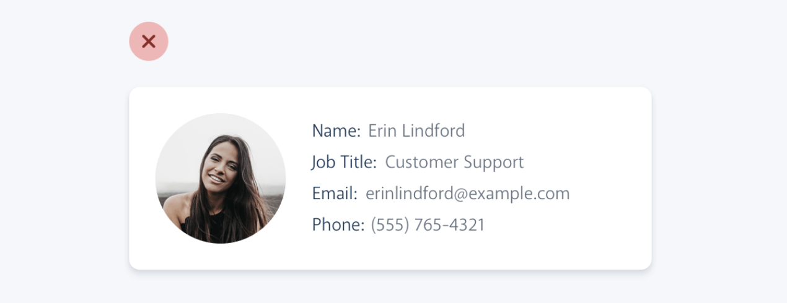
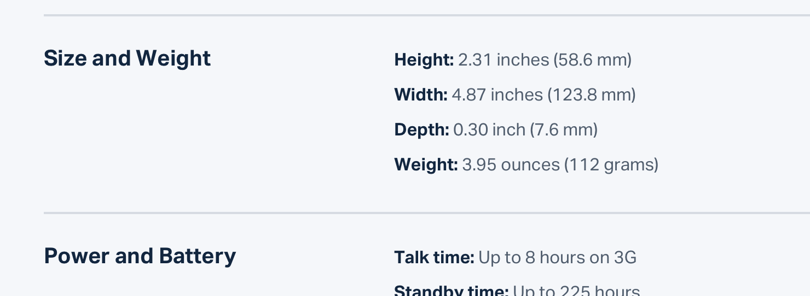

## Emphasizing by De-emphasizing

Sometimes, to make an element stand out, it's more effective to de-emphasize the elements competing with it. This technique can be applied to various interface elements, from navigation items to entire sections of a page.

For example, despite trying to make this active nav item “pop” by giving it a different color, it still doesn’t really stand out compared to the inactive items:

When you run into situations like this, instead of trying to further emphasize the element you want to draw attention to, figure out how you can de-emphasize the elements that are competing with it. You could do that by giving the inactive items a softer color so they sit more in the background.

You can apply this thinking to bigger pieces of an interface as well. For example, if a sidebar feels like it’s competing with your main content area, don’t give it a background color — let the content sit directly on the page background instead.

## Labels

The problem with this approach is that it makes it difficult to present the data with any sort of hierarchy; every piece of data is given equal emphasis.

### You might not need a label at all

In a lot of situations, you can tell what a piece of data is just by looking at the format.  
For example, 'sonam@example.com' is an email address, (555) 765-4321 is a phone number, and $19.99 is a price.

When the format isn't enough, the context often is. When you see the phrase "Customer Support" listed below someone's name in an employee directory, you don't need a label to make the connection that that is the department the person works in.

When you're able to present data without labels, it's much easier to emphasize important or identifying information, making the interface easier to use while at the same time making it feel more "designed".

### Effective Use of Labels

Labels can sometimes be unnecessary or even detrimental to the clarity of an interface. Learn when to use labels, when to emphasize them, and how to present data without labels for a cleaner, more intuitive design.

If you're designing an interface where you know the user will be looking for the label, it might make sense to emphasize the label instead of the data.  
This is often the case on information-dense pages, like the technical specifications of a product.

Don't de-emphasize the data too much in these scenarios; it's still important information. Simply using a darker color for the label and a slightly lighter color for the value is often enough.
