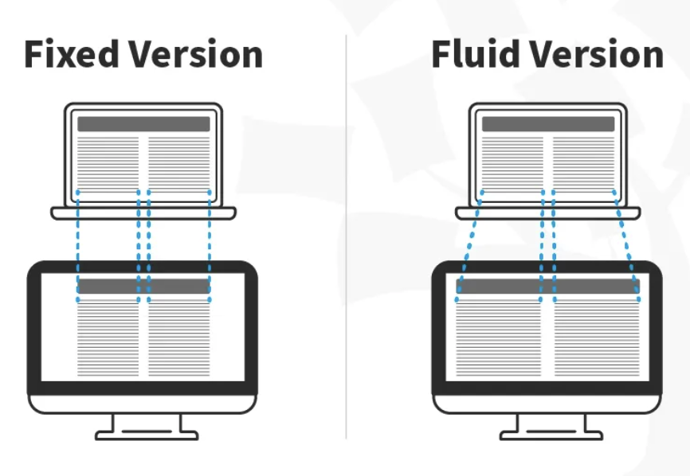

## Responsive Web Design

Responsive Web Design is an approach to design web content that appears regardless of the resolution governed by the device. If you open a responsive site on the desktop and change the browser window's size, the content will dynamically rearrange itself to fit the browser window. On mobile phones, the site checks for the available space and then presents itself in the ideal arrangement. Designers should catch up with this diversity and cater to various screen sizes.

## Principles of Responsive Mobile Web Design

In 2010, Ethan Marcotte coined the term responsive web design. Marcotte defines three RWD principles:

### Fluid Grid Layout

This fixed unit used to define the grid size was a major problem towards supporting multiple devices. 

In this image, you can see that the fixed version of the content has the same width regardless of the device, whereas in the fluid version, the content fills the available screen space of the device.

### Fluid Images

When you use fluid grids to define a layout using relative values (such as percentages), nothing on a layout will have a constant size across all devices. This means that images in your layout will need to be resized for each screen real estate. That's where fluid images enter the picture!  
Much like water, fluid images take on the size of their container. For non-photographic images, such as icons, you can use SVG files. These file formats are lightweight, and you can scale them to any resolution without quality loss.

### CSS3 Media Queries

Developers use CSS media queries to define breakpoints based on specific device classes. Breakpoints are specific screen sizes at which the layout of your website will change.

