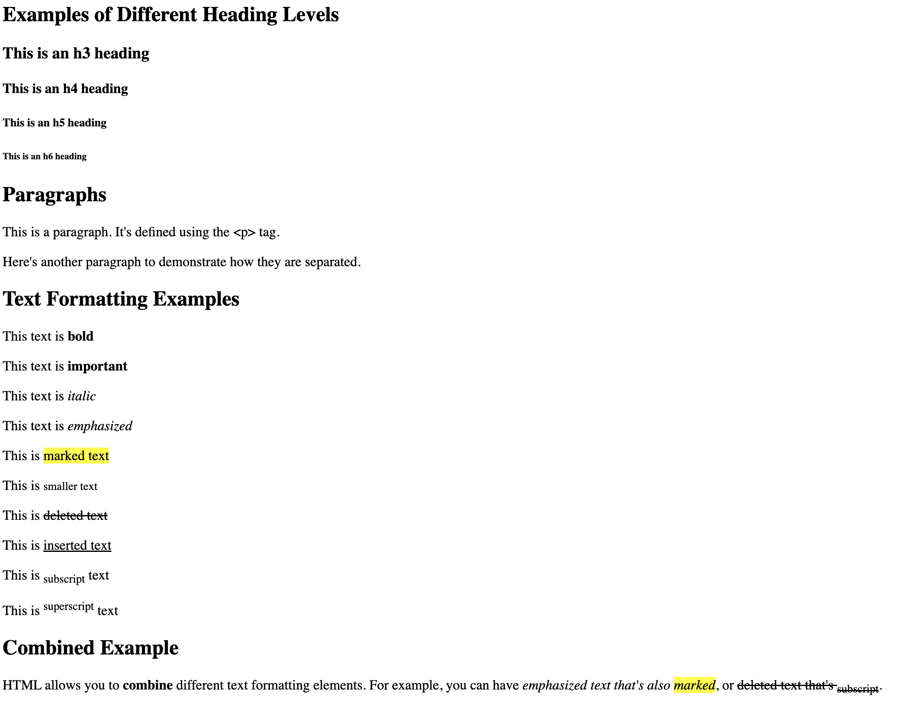

`<html></html>` — the `<html>` element

This element wraps all the content on the entire page and is sometimes known as the root element. It also includes the `lang` attribute, setting the primary language of the document.

`<head></head>` — the `<head>` element

This element acts as a container for all the stuff you want to include on the HTML page that isn't the content you are showing to your page's viewers. This includes things like keywords and a page description that you want to appear in search results, CSS to style the content, character set declarations, and more.

 `<title></title>` — the `<title>` element

This sets the title of your page, which is the title that appears in the browser tab the page is loaded in. It is also used to describe the page when you bookmark or favorite it.

`<body></body>` — the `<body>` element

This contains all the content that you want to show to web users when they visit your page, whether that's text, images, videos, games, playable audio tracks, or whatever else.

## Headings

HTML headings are defined with the `<h1>` to `<h6>` tags.  
- `<h1>` defines the most important heading.  
- `<h6>` defines the least important heading.

## Paragraphs

HTML paragraphs are defined with the `<p>` tag.

## Text Formatting

Formatting elements were designed to display special types of text:

- `<b>` - Bold text  
- `<strong>` - Important text (bold)  
- `<i>` - Italic text  
- `<em>` - Emphasized text (Italic)  
- `<mark>` - Marked text (highlighted)  
- `<small>` - Smaller text  
- `<del>` - Deleted text (strikethrough)  
- `<ins>` - Inserted text (Underlined)  
- `<sub>` - Subscript text  
- `<sup>` - Superscript text


```html
 <!-- <h1> defines the most important heading -->
    <!-- <h6> defines the least important heading -->
    
        <h2>Examples of Different Heading Levels</h2>
        <h3>This is an h3 heading</h3>
        <h4>This is an h4 heading</h4>
        <h5>This is an h5 heading</h5>
        <h6>This is an h6 heading</h6>
    
        <!-- Paragraphs -->
        <!-- HTML paragraphs are defined with the <p> tag -->
        <h2>Paragraphs</h2>
        <p>This is a paragraph. It's defined using the &lt;p&gt; tag.</p>
        <p>Here's another paragraph to demonstrate how they are separated.</p>
    
        <!-- Text Formatting -->
        <h2>Text Formatting Examples</h2>
        <!-- Formatting elements were designed to display special types of text -->
        
        <p>This text is <b>bold</b> </p>
        <p>This text is <strong>important</strong></p>
        <p>This text is <i>italic</i></p>
        <p>This text is <em>emphasized</em></p>
        <p>This is <mark>marked text</mark></p>
        <p>This is <small>smaller text</small></p>
        <p>This is <del>deleted text</del></p>
        <p>This is <ins>inserted text</ins></p>
        <p>This is <sub>subscript</sub> text</p>
        <p>This is <sup>superscript</sup> text</p>
    
        <!-- Combined example -->
        <h2>Combined Example</h2>
        <p>HTML allows you to <strong>combine</strong> different text formatting elements. 
        For example, you can have <em>emphasized text that's also <mark>marked</mark></em>, 
        or <del>deleted text that's <sub>subscript</sub></del>.</p> 
```

### output:

