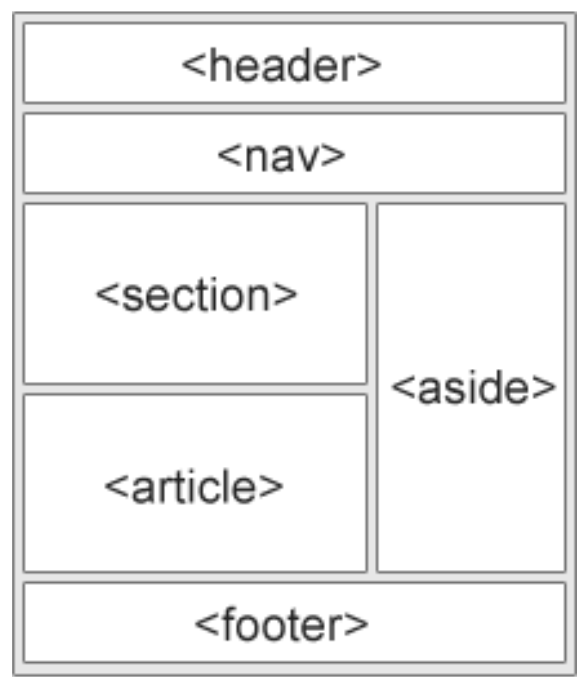

# Semantic elements

Semantic elements are used to define different parts of a web page

Examples of semantic elements: 
- `<article>`
- `<aside>`
- `
`
- `<figcaption>`
- `<figure>`
- `<footer>`
- `<header>`
- `<main>`
- `<mark>`
- `<nav>`
- `<section>`
- `
`
- `<time>`

# Non-semantic elements

They don't have any meaning. They don't tell anything about the content they contain. These tags are used to apply CSS styling to content.

Non-semantic elements:
* `
` - used to group elements together
* `` - used to style text