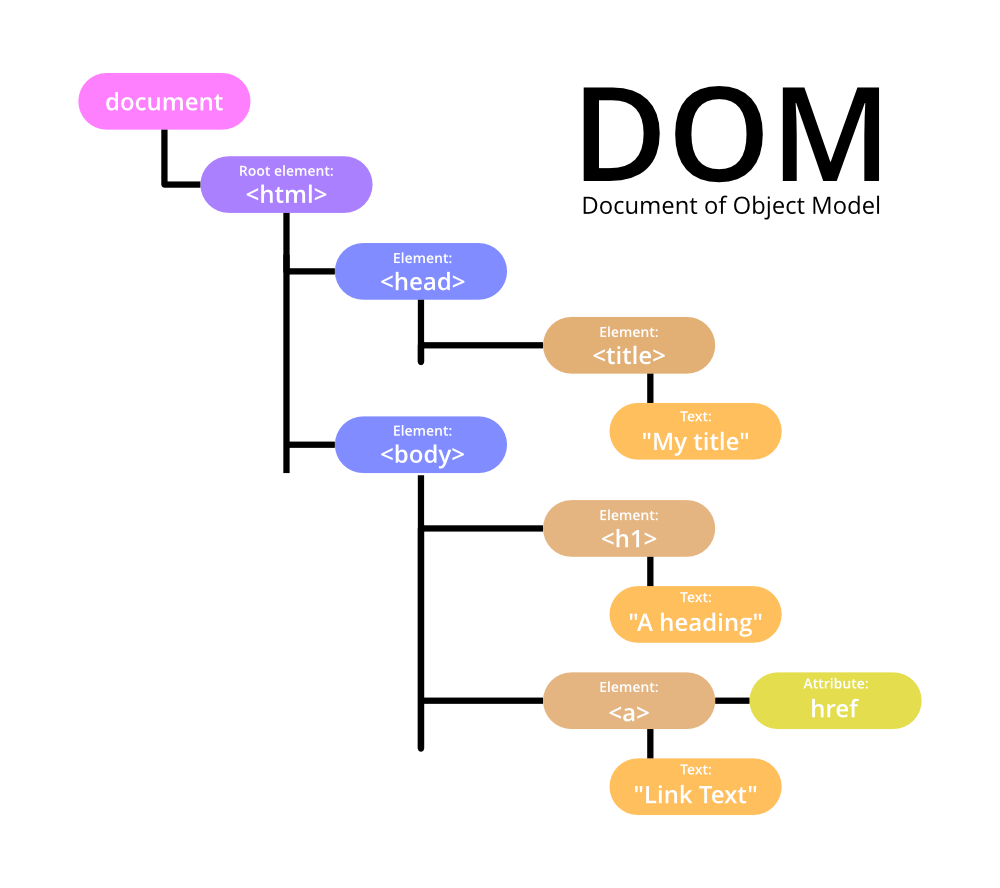

# DOM (Document Object Model)

### What is the DOM?
The DOM (Document Object Model) is a programming interface for HTML and XML documents.  
It represents the structure of a document as a tree-like hierarchy of objects. Each object represents a part of the document, such as an element, attribute, or text.



---

### Browser Environment
When you open a webpage, the browser creates a special environment to run JavaScript. This environment includes:

- **The window object**: Represents the browser window or tab
- **The document object**: Represents the webpage content

---

### DOM Tree Structure

The DOM represents HTML as a tree-like structure of objects.
Each HTML tag becomes an object, nested tags become child objects of their parent.
Text within tags becomes text objects.

Imagine your HTML document as a family tree:

- The `<html>` tag is the root (great-grandparent)
- Tags inside `<html>` (like `<head>` and `<body>`) are its children
- Tags inside these are grandchildren, and so on

---

#### Example:
```html
<!DOCTYPE html>
<html>
  <head>
    <title>My Page</title>
  </head>
  <body>
    <h1>Welcome!</h1>
    <p>This is my page.</p>
  </body>
</html>
```
In this tree:

- `<html>` is the root
- `<head>` and `<body>` are children of `<html>`
- `<title>` is a child of `<head>`
- `<h1>` and `<p>` are children of `<body>`

---

### Traversing the DOM
You can move through the DOM tree using properties like:

- **parentNode**: Get the parent of an element
- **childNodes**: Get all child nodes of an element
- **firstChild** / **lastChild**: Get the first or last child of an element
- **nextSibling** / **previousSibling**: Get the next or previous sibling of an element

---

#### Example:
```js
// Get the body element
let body = document.body;

// Get the first child of the body
let firstChild = body.firstChild;

// Get the last child of the body
let lastChild = body.lastChild;

// Get the parent of an element (in this case, it would be the body)
let parentOfLastChild = lastChild.parentNode;
